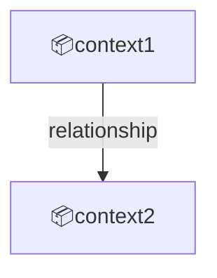
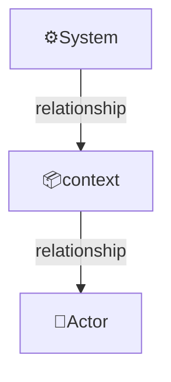

Domain specifications define the target subject area, its external actors, concepts, bounded contexts, and context map.

File: `uspecs/specs/{domain}/domain.md`

Example domains are `prod` and `devops`:

- `prod`: The business logic and customer-facing capabilities of the product - what the product does for its users
- `devops`: development, testing, delivery, deployment, maintenance (monitoring, observability, etc.) aspects of the product

## Structure overview

```markdown
# Domain: {domain}

{Domain definition, one phrase}

## Overview

{Scope}

{Key features}

## External actors

Roles:

- 👤RoleName
  - Description

Systems:

- ⚙️SystemName
  - Description

---

## Concepts

- **Concept1**:
  - Definition1

- **Concept2**:
  - Definition2

---

## Contexts

- **{context-id-1}**:
  - {description}

- **{context-id-2}**:
  - {description}

### Context map

{mermaid graph showing dependencies between contexts}

### {context-id-1}

Relationships:

{mermaid graph showing relationships with external actors and other contexts}

### {context-id-2}

Relationships:

{mermaid graph showing relationships with external actors and other contexts}

...
```

---

## Structure details

Context map example:




Relationships example:




---

## Rules

- Emoji prefixes: 👤 for roles, ⚙️ for systems, 📦 for contexts
- Contexts section: start with a list of contexts, each with a short description, followed by the Context map and one h3 subsection per context
- Context map (`### Context map`): Mermaid graph showing dependencies between contexts
- Per-context subsection (`### {context-id}`): Mermaid graph showing the context's relationships to actors, systems, and other contexts
- Concepts section: domain-specific terms that need definition for shared understanding

## Examples

For prod domain example, see [example-prod.md](./example-prod.md).
For devops domain example, see [example-devops.md](./example-devops.md).
