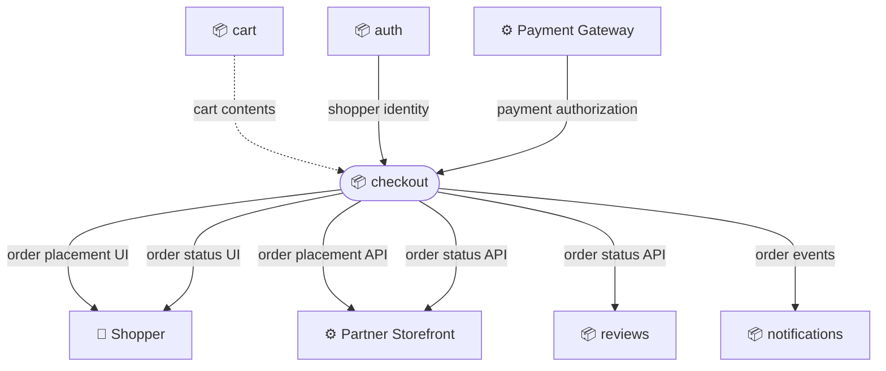
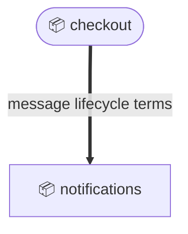
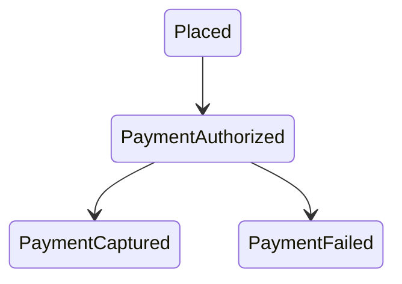
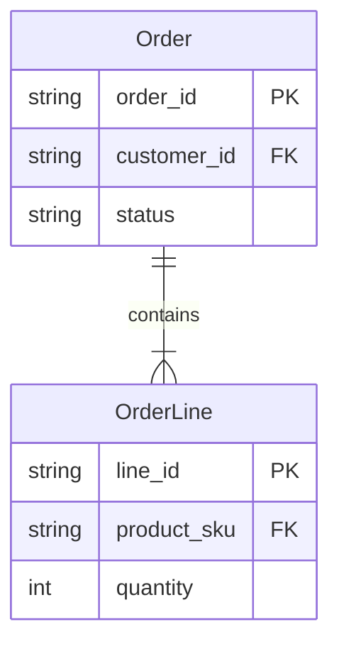

# Bounded Context: checkout

## Executive summary

Checkout - turn a shopper's cart into a placed, paid order.

Scope:

- Converts a shopper's cart into a placed, paid order
- Coordinates payment authorization and capture with the external Payment Gateway

Out of scope:

- Cart management (adding/removing items, changing quantities, etc.)

## External actors

Roles:

- 👤 Shopper

Systems:

- ⚙️ Payment Gateway
- ⚙️ Partner Storefront

## Relationships

### Service exposure

Arrows point upstream -> downstream. Edge style encodes the exposure pattern:

- `--->` solid: Open Host Service (ohs) - public, general-purpose contract for many consumers
- `-..->` dotted: Customer-Supplier (c/s) - contract tailored to one or a few known consumers

#### auth -> checkout: shopper identity (ohs + cf)

Upstream:

- Canonical service contract detail: [auth](../auth/context.md)
- Provides validated shopper identity: stable shopper id, authenticated session, and identity claims needed to place the order

Downstream:

- Validates shopper identity/token (query)
- Local conformity note: adopts upstream stable shopper id and authenticated session as-is; no separate formal language is published for this model-alignment stance

#### cart -> checkout: cart contents (c/s)

Upstream:

- Canonical service contract detail: [cart](../cart/context.md)
- Provides an immutable `CartSnapshot`: cart id, shopper id, product references, quantities, and pricing inputs used to create the order

Downstream:

- Reads the `CartSnapshot` (query)

#### Payment Gateway -> checkout: payment authorization (ohs + acl)

Upstream:

- External provider reference: public payment API documentation
- Contract: gateway public payment API

Downstream:

- Authorizes/captures payment (command)
- Owns the local ACL translation notes because the upstream has no Context spec
- `PaymentGatewayClient` translates the proprietary authorization response into `PaymentCaptured` event and `Order` status

#### checkout: order events channel (ohs + pl)

Provider:

- Channel: `checkout.order-events`
- Events: `OrderPlaced`, `PaymentCaptured`
- Language: `OrderEvents.v1`
- Compatibility: backward-compatible additive changes only

Consumers:

- 📦 notifications
  - Consumes order lifecycle events through the broker to send customer-facing messages

#### checkout: order placement API (ohs + pl)

Provider:

- Contract: `POST /api/checkout/orders`
- Message: place order (command)
- Language: `OrderPlacement.v1`
- Authorization: partner channel scope

Consumers:

- ⚙️ Partner Storefront
  - Place orders through the same public contract

#### checkout: order placement UI (ohs + pl)

Provider:

- Interface: checkout web UI
- Interaction: place order
- Language: `OrderPlacement.v1`
- Authorization: `Shopper` role

Consumers:

- 👤 Shopper
  - Places an order from their own cart

#### checkout: order status API (ohs + pl)

Provider:

- Contract: `GET /api/checkout/orders/{order_id}/status`
- Model: `OrderStatus.v1`
- Compatibility: backward-compatible additive changes only
- Authorization: partner channel scope

Consumers:

- ⚙️ Partner Storefront
  - Conform to `OrderStatus.v1` when displaying or synchronizing order state
- 📦 reviews
  - Conforms to `OrderStatus.v1` when checking whether a shopper can review a purchased product

#### checkout: order status UI (ohs + pl)

Provider:

- Interface: checkout web UI
- Model: `OrderStatus.v1`
- Compatibility: backward-compatible additive changes only
- Authorization: `Shopper` role

Consumers:

- 👤 Shopper
  - Reads order state through the checkout UI

### Model alignment

Arrows point upstream -> downstream. Edge style encodes the alignment pattern:

- `===>` thick: Published Language (pl) - the upstream publishes a documented, versioned language/model

#### checkout -> notifications: message lifecycle terms (pl)

Upstream:

- Language: `MessageLifecycleTerms.v1`
- Compatibility: backward-compatible additive changes only
- Separate from `checkout.order-events`

Downstream:

- Uses published message lifecycle terms in customer-facing message templates

## Model specification

### Entities

#### Order (aggregate)

A placed purchase.

Contains: `OrderLine`.
Embeds: `Address`, `Money`.
References: shopper identity from `auth`.

Fields:

| Field            | Type      | Description                        |
|------------------|-----------|------------------------------------|
| `order_id`       | `string`  | Stable identifier for the order    |
| `customer_id`    | `string`  | Shopper identity from auth         |
| `status`         | `string`  | Current order lifecycle state      |
| `total_amount`   | `decimal` | Monetary amount of the order total |
| `total_currency` | `string`  | Currency for the order total       |
| `ship_line1`     | `string`  | First line of the shipping address |
| `ship_city`      | `string`  | Shipping city                      |
| `ship_country`   | `string`  | Shipping country                   |

Invariants:

- `Order` has at least one `OrderLine`.
- `Order.total_amount` equals the sum of its `OrderLine` amounts after pricing rules are applied.
- Captured payment cannot be recorded unless payment authorization has succeeded.

State transitions:

ERD:

##### OrderLine

One line item within an Order.

Owned by: `Order`.

Fields:

| Field         | Type      | Description                          |
|---------------|-----------|--------------------------------------|
| `line_id`     | `string`  | Stable identifier for the order line |
| `product_sku` | `string`  | Product reference from catalog       |
| `quantity`    | `integer` | Ordered quantity                     |
| `unit_amount` | `decimal` | Monetary amount for one unit         |

### Value Objects

#### Address

Shipping destination; immutable.

Fields:

| Field     | Type     | Description         |
|-----------|----------|---------------------|
| `line1`   | `string` | First address line  |
| `city`    | `string` | Destination city    |
| `country` | `string` | Destination country |

#### CartSnapshot

Immutable cart contents captured when checkout begins.

Fields:

| Field         | Type           | Description                             |
|---------------|----------------|-----------------------------------------|
| `cart_id`     | `string`       | Cart identifier from cart               |
| `shopper_id`  | `string`       | Shopper identity associated with cart   |
| `items`       | `list<string>` | Product and quantity inputs for checkout |

#### Money

Amount and currency; immutable, value-equal.

Fields:

| Field      | Type      | Description       |
|------------|-----------|-------------------|
| `amount`   | `decimal` | Decimal amount    |
| `currency` | `string`  | ISO currency code |

## Lifecycle and behavior

### Events

#### OrderPlaced

Published on `checkout.order-events` when a shopper confirms an order.

#### PaymentCaptured

Published on `checkout.order-events` when the `⚙️ Payment Gateway` captures payment.
