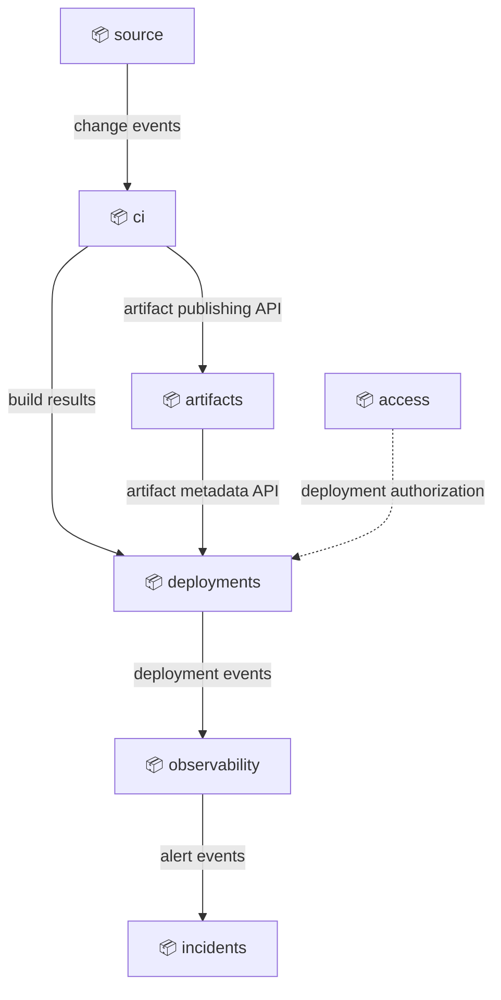
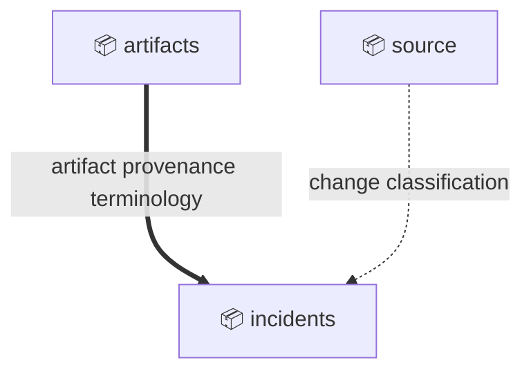

# Domain: devops

## Executive summary

DevOps System - the technical domain for building, delivering, deploying, and operating the product.

Scope:

- Accept source changes, verify them, and publish deployable artifacts
- Deploy releases to runtime targets
- Observe runtime health and coordinate incident response
- Control deployment access and operational permissions

Out of scope:

- Product business behavior and customer-facing shopping workflows
- Back-office finance, HR, and procurement processes
- Cloud-provider implementation details below the platform contract

## Subdomains

### Development (Supporting)

Move product changes from source control to verified, deployable artifacts.

| Capability               | Bounded Context(s) |
|--------------------------|--------------------|
| Source change management | source             |
| Continuous integration   | ci                 |
| Artifact publishing      | artifacts          |

### Operations (Supporting)

Run production systems, observe runtime health, and coordinate incident response.

| Capability            | Bounded Context(s) |
|-----------------------|--------------------|
| Release deployment    | deployments        |
| Runtime observability | observability      |
| Incident response     | incidents          |

### Access (Generic)

Manage technical identities, deployment permissions, and operational access.

| Capability               | Bounded Context(s) |
|--------------------------|--------------------|
| Deployment authorization | access             |

## External actors

Roles:

- 👤 Developer
  - Commits changes and reviews build/test feedback
- 👤 Release Manager
  - Approves production releases and coordinates rollout timing
- 👤 SRE
  - Monitors runtime health and responds to incidents

Systems:

- ⚙️ Git Provider
  - External system that hosts repositories and emits source-change events
- ⚙️ Cloud Provider
  - External platform that hosts runtime infrastructure
- ⚙️ Pager Service
  - External system that sends incident notifications

---

## Bounded Contexts

- [source](source/context.md)
  - Source revisions, pull requests, and change metadata

- [ci](ci/context.md)
  - Build orchestration, verification, and build results

- [artifacts](artifacts/context.md)
  - Versioned deployable artifacts and provenance

- [deployments](deployments/context.md)
  - Release planning, deployment execution, runtime targets, and rollout state

- [observability](observability/context.md)
  - Metrics, logs, traces, and health signals

- [incidents](incidents/context.md)
  - Incident lifecycle, response coordination, and post-incident records

- [access](access/context.md)
  - Technical permissions for release and operational actions

### Service exposure

Arrows point upstream -> downstream. Edge style encodes the exposure pattern:

- `--->` solid: Open Host Service
- `-..->` dotted: Customer-Supplier

### Service exposure index

| Upstream      | Downstream    | Contract                    | Exposure          | Alignment          |
|---------------|---------------|-----------------------------|-------------------|--------------------|
| access        | deployments   | deployment authorization    | Customer-Supplier | Conformist         |
| artifacts     | deployments   | artifact metadata API       | Open Host Service | Published Language |
| ci            | artifacts     | artifact publishing API     | Open Host Service | Published Language |
| ci            | deployments   | build results               | Open Host Service | Published Language |
| deployments   | observability | deployment events           | Open Host Service | Published Language |
| observability | incidents     | alert events                | Open Host Service | Published Language |
| source        | ci            | change events               | Open Host Service | Published Language |

### Model alignment

Arrows point upstream -> downstream. Edge style encodes the alignment pattern:

- `===>` thick: Published Language
- `--->` solid: Conformist
- `-..->` dotted: Anti-Corruption Layer

### Model alignment index

| Upstream  | Downstream | Model/language                  | Alignment             |
|-----------|------------|---------------------------------|-----------------------|
| artifacts | incidents  | artifact provenance terminology | Published Language    |
| source    | incidents  | change classification           | Anti-Corruption Layer |

---
