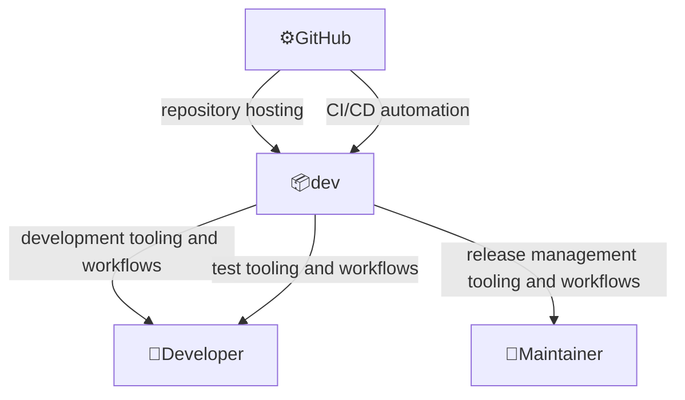
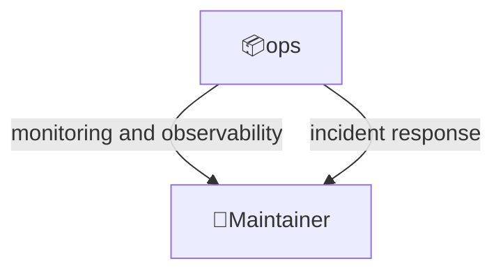
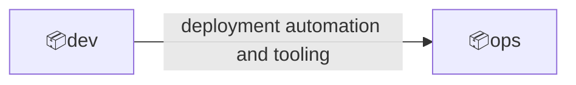

# Domain: devops

Development, testing, delivery, deployment, and operations (monitoring, observability, etc.) aspects of the product

## Overview

Scope:

- Tools, scripts, and configuration files supporting product devops.

Key features:

- Development and test tooling and workflows
- Release management automation
- CI/CD integration with GitHub
- Production operations, monitoring, and incident response

## External actors

Roles:

- 👤Developer
  - Modifies codebase
- 👤Maintainer
  - Makes releases

Systems:

- ⚙️GitHub
  - A platform that allows to store, manage, share code and automate related workflows

---

## Contexts

### dev

Development, testing, and release automation.

Relationships:

### ops

Production operations, monitoring, and incident response.

Relationships:

---

## Context map

