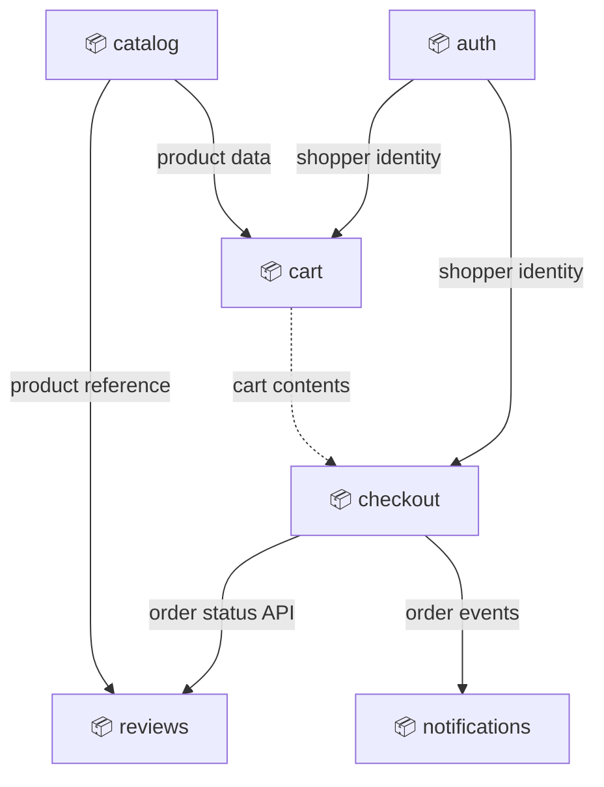
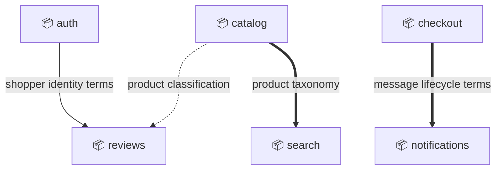

# Domain: prod

## Executive summary

Online Shopping System - the customer-facing e-commerce product.

Scope:

- Browse a product catalog, build a shopping cart, and place and pay for orders
- Collect customer reviews and authenticate shoppers
- Notify shoppers about order lifecycle changes

Out of scope:

- Warehouse, inventory, and shipping logistics
- Marketing, promotions, and recommendations
- Back-office accounting and tax reporting

## Subdomains

### Shopping (Core)

Enable shoppers to browse the catalog and place paid orders.

| Capability                  | Realized by     |
|-----------------------------|-----------------|
| Catalog browsing and search | catalog, search |
| Cart and checkout           | cart, checkout  |
| Order placement and payment | checkout        |
| Order notifications         | notifications   |

### Reviews (Supporting)

Collect customer feedback on products.

| Capability       | Realized by |
|------------------|-------------|
| Customer reviews | reviews     |

### Auth (Generic)

Identify and authenticate shoppers.

| Capability          | Realized by |
|---------------------|-------------|
| User authentication | auth        |

## External actors

Roles:

- 👤 Shopper
  - Browses the catalog, builds a cart, and places orders
- 👤 CatalogManager
  - Maintains product listings and pricing

Systems:

- ⚙️ PaymentGateway
  - External system that authorizes and captures payments
- ⚙️ PartnerStorefront
  - External sales channel that places and tracks shopper orders through checkout APIs

---

## Bounded Contexts

- [catalog](catalog/context.md)
  - Product listings and pricing

- [search](search/context.md)
  - Search indexing and facets

- [cart](cart/context.md)
  - Per-shopper shopping cart

- [checkout](checkout/context.md)
  - Order placement and payment coordination

- [notifications](notifications/context.md)
  - Customer-facing order notifications

- [reviews](reviews/context.md)
  - Customer feedback on products

- [auth](auth/context.md)
  - Shopper identity and authentication

### Service exposure

Arrows point upstream -> downstream. Edge style encodes the exposure pattern:

- `--->` solid: Open Host Service
- `-..->` dotted: Customer-Supplier

### Service exposure index

| Upstream | Downstream    | Contract              | Exposure          | Alignment          |
|----------|---------------|-----------------------|-------------------|--------------------|
| auth     | checkout      | shopper identity API  | Open Host Service | Conformist         |
| auth     | cart          | shopper identity API  | Open Host Service | Conformist         |
| catalog  | cart          | product data API      | Open Host Service | Published Language |
| catalog  | reviews       | product reference API | Open Host Service | Conformist         |
| cart     | checkout      | cart contents query   | Customer-Supplier | -                  |
| checkout | notifications | order events channel  | Open Host Service | Published Language |
| checkout | reviews       | order status API      | Open Host Service | Published Language |

### Model alignment

Arrows point upstream -> downstream. Edge style encodes the alignment pattern:

- `===>` thick: Published Language
- `--->` solid: Conformist
- `-..->` dotted: Anti-Corruption Layer

### Model alignment index

| Upstream | Downstream    | Model/language          | Alignment             |
|----------|---------------|-------------------------|-----------------------|
| auth     | reviews       | shopper identity terms  | Conformist            |
| catalog  | reviews       | product classification  | Anti-Corruption Layer |
| catalog  | search        | product taxonomy        | Published Language    |
| checkout | notifications | message lifecycle terms | Published Language    |

---
