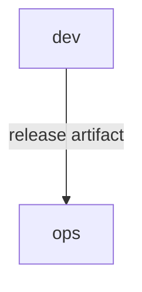
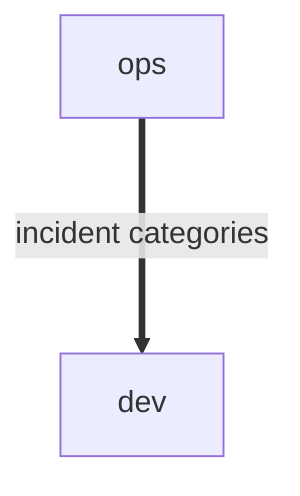

# Domain: devops

## Executive summary

DevOps System - a compact technical domain for building, releasing, and operating the product.

Scope:

- Turn source changes into deployable release artifacts
- Deploy releases and watch runtime health
- Coordinate incident follow-up with development

Out of scope:

- Product business behavior
- Detailed platform implementation
- Organization-wide identity and access management

## Subdomains

### Delivery (Supporting)

Move product changes from source to production operation.

| Capability             | Realized by |
|------------------------|-------------|
| Build and verification | dev         |
| Release operation      | ops         |

## External actors

Roles:

- Developer
  - Commits changes and fixes defects
- SRE
  - Deploys releases and responds to incidents

Systems:

- CloudProvider
  - Hosts runtime infrastructure

---

## Bounded Contexts

- [dev](dev/context.md)
  - Source changes, verification, and release artifacts

- [ops](ops/context.md)
  - Deployments, runtime health, and incident response

### Service exposure

Arrows point upstream -> downstream. Edge style encodes the exposure pattern:

- `--->` solid: Open Host Service
- `-..->` dotted: Customer-Supplier

### Service exposure index

| Upstream | Downstream | Contract         | Exposure          | Alignment          |
|----------|------------|------------------|-------------------|--------------------|
| dev      | ops        | release artifact | Open Host Service | Published Language |

### Model alignment

Arrows point upstream -> downstream. Edge style encodes the alignment pattern:

- `===>` thick: Published Language
- `--->` solid: Conformist
- `-..->` dotted: Anti-Corruption Layer

### Model alignment index

| Upstream | Downstream | Model/language      | Alignment          |
|----------|------------|---------------------|--------------------|
| ops      | dev        | incident categories | Published Language |

---
